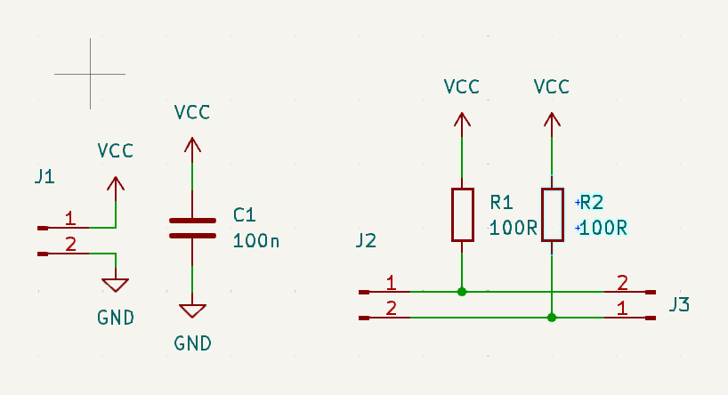
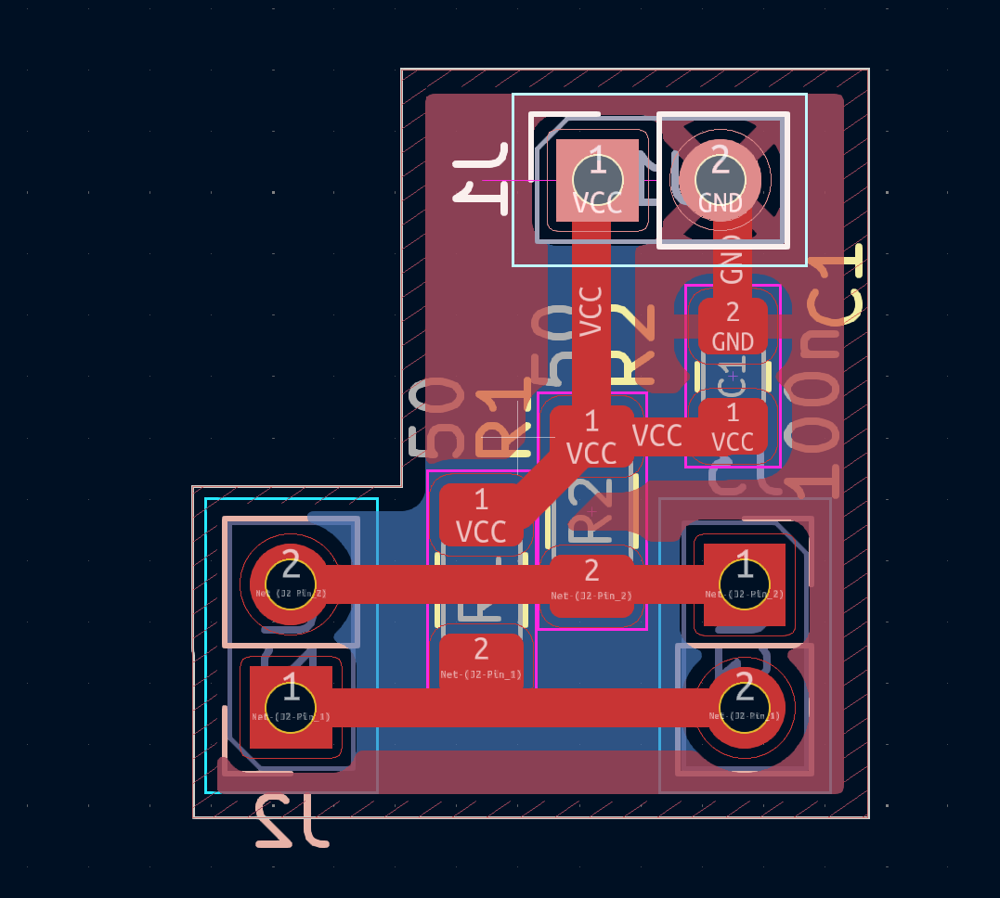

# The Idea
There is a document: [XAPP523 – LVDS 4x Asynchronous Oversampling](https://docs.amd.com/v/u/en-US/xapp523-lvds-4x-asynchronous-oversampling) describing the possibility of implementing an LVDS receiver using Giga Transceivers at speeds up to 1.25 Gbps (DDR).  
The project goal is to try to implement the idea at lower frequencies in Verilog.

The main idea is to use two SERDES blocks in oversample mode. This gives us the possibility to get 8 samples of the signal of interest per clock cycle.

- 4 samples will be received from the main SERDES at 0°, 90°, 180°, and 270°.  
- The second SERDES is fed with the signal delayed by 45°. With the same clocks we then receive 45°, 135°, 225°, and 315°.  

By comparing 8 pairs of samples we can effectively find edges and recover the clock.  
Xilinx provides a state machine that can "follow" these edges and provide 1, 2, or 3 bits per clock.  

- 1 and 3 bits are edge cases when the clock is too slow or too fast.  
- Most of the time, the algorithm provides 2 bits per tick.  

This means that to receive **200 Mbps** we need a **100 MHz clock** (half of the bitrate).  
Theoretically, we can receive up to **~1.2 Gbps** on Zynq-7010 or any 7-series device.  

---

# POC Implementation
I chose **Manchester encoding** because it is easy to debug while implementing the POC.  

As a source, I used the **Tang Nano 20k**, because it has a PLL with the ability to provide a 100 MHz source clock. This clock is slightly faster, so we can test the state machine.  

The sent pattern is:  
```
0xAA 0xAA 0xD5 0xAA 0xBB 0xCC 0xDD
```

The receiver uses `0xAA 0xAA 0xD5` as the preamble and start byte.  

The TX side is implemented with **True LVDS25** (but the bank is powered by 3.3 V. This can be dangerous, but works stably for me. Be careful if you try the same approach).  

I don’t have a 2.5 V bank available on my receiver Zynq-7010 board, so **TMDS** was selected as the differential standard. I had to add a small converter PCB with 2 pull-up 100 Ω resistors.  

---

# Current Status
1. Up to **400 Mbps (200 MHz)** transfer seems good.  
2. **600 Mbps (300 MHz)** is not reliable – about 30% loss or more, probably due to poor clock on Tang Nano 20k.  
3. Tested with a cheap HDMI cable and also with two wires manually twisted.  
4. No timing constraints were added. The project has negative slack with ILA enabled.  

---

# File Structure and Instructions  

## TX
1. TX board: [Tang Nano 20k](https://wiki.sipeed.com/hardware/en/tang/tang-nano-20k/nano-20k.html)  
2. Set clock frequency to **100 MHz** via debugger MCU: [example](https://wiki.sipeed.com/hardware/en/tang/tang-nano-20k/example/unbox.html)  
3. run to build the project `gw_sh tcl/gw_test_tx.tcl`
5. run upload firmware to the target```programmer_cli --device GW2AR-18C --run 2 --fs `realpath gw_test_tx/impl/pnr/gw_test_tx.fs` --location 28865```
   1. the locateion is taken from  `programmer_cli --scan-cables`

## RX
1. `cd` to project folder  
2. `. /tools/Xilinx/Vivado/2024.2/settings64.sh`  
3. Run:  
   ```bash
   vivado -s tcl/project_full.tcl
   ```
   (sometimes Vivado generates the script with an extra path, e.g. `./manchester/manchester/manchester.xpr`)  
4. Run:  
   ```bash
   vivado manchester/manchester.xpr
   ```
   or  
   ```bash
   vivado manchester/manchester/manchester.xpr
   ```
   (**TODO:** fix the script)  
5. Change device part to yours  
6. Generate bitstream  

## RX files
 - rtl/oversample.v - extracting 8 bit per clock by 2 serdes
 - rtl/data_recovery_unit.v - the state machine extracting bits
 - rtl/manchester_decoder2.v - decoder. loop: skips first 0xAA ->  compares second 16'hAAD5 ->  gather 4 bytes -> begin
 - rtl/top_receiver_xilinix.v - top module
 - ip/clk_wiz_0_1/clk_wiz_0_1.xci clocking wizard module. Needed clocks are clk_0(serdes), clk_90(serdes), clk_200 (for IODELAY), clk_100(decoder). clk_0, clk_90, clk_100 shoult have the same frequency

## RX wiring 

- 
- 
---
